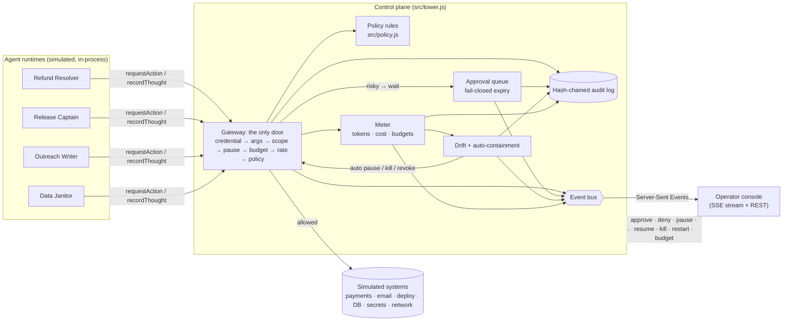

# Architecture snapshot

**agent events → control plane → operator UI**

## Data flow

1. **Agent events.** An agent script never touches a system. It calls `recordThought(text, tokens)` (its model call, metered as if the Tower were the LLM proxy) and `requestAction(tool, args)` (its intent).
2. **Control plane.** `requestAction` runs checks in a fixed order, and the first failure wins:
   | # | Check | Failure result |
   |---|-------|----------------|
   | 1 | Credential current, agent not killed | `credential_revoked` |
   | 2 | Tool exists, args valid (e.g. SQL must be a single `SELECT`) | `unknown_tool` / `invalid_args` |
   | 3 | Tool in the agent's scope | `out_of_scope` (violation) |
   | 4 | Not paused | `agent_paused` |
   | 5 | Task and daily budget | `budget_exceeded` (also pauses the agent) |
   | 6 | Rate limit | `rate_limited` |
   | 7 | Content policy on the arguments | allow / **approval** / deny |
   
   Approved-but-not-yet-run actions re-check the agent's state before executing, so a kill or pause between *approve* and *execute* wins.
3. **Operator UI.** Every state change is an event (`seq`, `ts`, `type`, `sev`, `summary`) on the room's bus. `GET /api/rooms/:room/stream` is a Server-Sent Events stream: a full state snapshot on connect and every ~2 s, plus each event as it happens (with `Last-Event-ID` resume). Interventions are `POST`s back to the same control plane.

## Containment layers (defence in depth)

| Layer | Catches | Response |
|-------|---------|----------|
| Scope + argument validation | Tools the agent shouldn't have, malformed calls | Deny, count as violation |
| Content guardrails | Mass delete, huge refunds, mass email | Deny outright or route to a human |
| Circuit breakers | Budget blow-ups, rate bursts, loops | Pause (resumable) |
| Auto-containment | 3 violations / 2 min, drift ≥ 80 | Kill and revoke credentials |
| Human operator | Anything else | Pause, kill, restart, halt fleet |
| **Credential revocation** | An agent that **ignores** a kill | Every later call refused at the gateway |

## Key design decisions

- **The gateway is the enforcement point, not the agent SDK.** Kill = revoke, so a misbehaving agent cannot opt out. The simulated rogue does exactly that, and the drill proves the gateway holds.
- **Fail closed.** Unanswered approvals expire as *denied*; approved actions for halted agents are voided; the audit log never drops silently.
- **Tenants are rooms.** Each room has its own fleet, systems, approval queue and audit log. The unguessable room id is the capability. Approvals carry a `routedTo` team (Finance, Platform, Growth, Data) and the console filters by team.
- **Audit is tamper-evident.** Each entry hashes the previous one (SHA-256). `GET …/audit/verify` recomputes the chain; CSV/JSON export is available. CSV cells beginning `= + - @` are neutralised, since agents control some of that text.
- **One clock.** All windows, timeouts and timestamps go through `Clock`, so the whole system can be run 40× faster in tests and behaves identically.
- **Zero dependencies.** Node 22 standard library only, so a clean clone runs with `npm start`.
- **UI is XSS-proof by construction.** No `innerHTML` anywhere; agent-controlled strings are text nodes, and the CSP forbids inline script and style.

## Files

| Path | Role |
|------|------|
| `src/tower.js` | Gateway, approvals, controls, containment, metering, read models |
| `src/policy.js`, `src/tools.js` | Guardrail table, tool catalog, simulated systems |
| `src/agent.js`, `src/agents/roster.js`, `src/agents/faults.js` | Agent runtime, the four agents, injectable faults |
| `src/drift.js`, `src/audit.js`, `src/pricing.js` | Drift score, hash-chained log, cost model |
| `src/rooms.js`, `server.js` | Tenants + GC, HTTP/SSE server |
| `public/` | Operator console (vanilla JS, no build step) |
| `test/`, `scripts/e2e.mjs`, `scripts/rogue-drill.js` | Unit, scenario, HTTP, browser E2E, failure drill |

## Out of scope (honest limits)

- Agents are scripted simulations, not LLM calls; reasoning text is authored. The control plane is model-agnostic and would sit in front of real agents unchanged.
- No authentication or per-operator RBAC: operator names are self-declared and audited. A production build needs SSO and team-scoped approval rights.
- State is in memory (rooms are garbage-collected when idle). A production build persists events and audit to durable storage.
- Token prices are illustrative (`src/pricing.js`).
